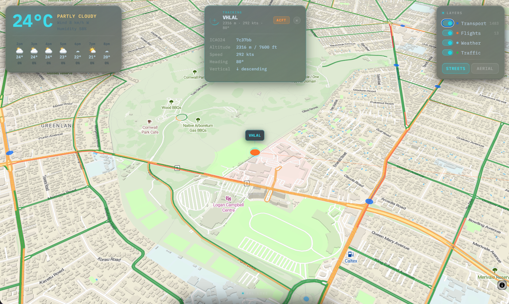
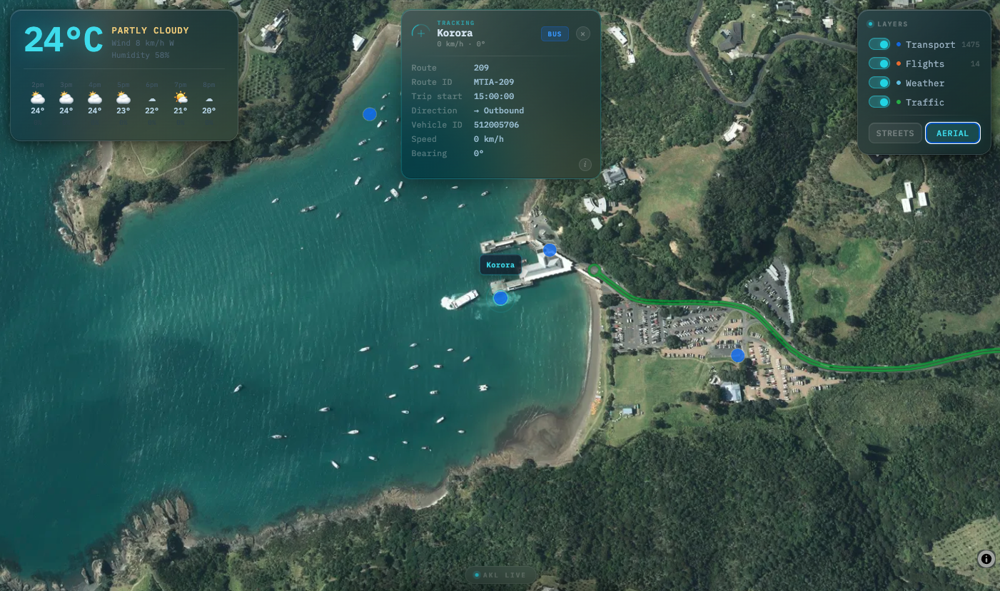

# Auckland Live

Real-time geospatial dashboard for Auckland — public transport, aircraft, and weather rendered over a vector basemap using MapLibre GL JS and deck.gl.




## Running locally

You need two terminals.

**Terminal 1 — API proxy** (handles CORS + injects API keys):
```bash
node proxy.js
```

**Terminal 2 — static file server:**
```bash
npx serve .
```

Then open `http://localhost:3000` (or whatever port `serve` picks).

## Config

Copy the example config and fill in your keys:

```bash
cp config.local.example.js config.local.js
```

```js
// config.local.js
export const CONFIG = {
  MAPTILER_KEY: '...',           // maptiler.com — free tier
  AT_API_KEY: '...',             // dev-portal.at.govt.nz — free
  OPENSKY_CLIENT_ID: '...',      // opensky-network.org — free account
  OPENSKY_CLIENT_SECRET: '...',
  LINZ_API_KEY: '...',           // basemaps.linz.govt.nz — free
  TOMTOM_API_KEY: '...',         // developer.tomtom.com — free tier
};
```

`config.local.js` is gitignored. Never commit it.

## API keys

| API | Where to get it | Cost |
|-----|----------------|------|
| MapTiler | [cloud.maptiler.com](https://cloud.maptiler.com) | Free (100k req/month) |
| Auckland Transport | [dev-portal.at.govt.nz](https://dev-portal.at.govt.nz) | Free |
| OpenSky Network | [opensky-network.org](https://opensky-network.org) | Free (4k credits/day authenticated) |
| LINZ Basemaps | [basemaps.linz.govt.nz](https://basemaps.linz.govt.nz) | Free |
| TomTom | [developer.tomtom.com](https://developer.tomtom.com) | Free (50k tile req/day) |
| Open-Meteo | — | No key needed |

## Architecture

```
Browser (MapLibre + deck.gl)
  ↓
proxy.js :3001              ← local dev only
  ├── /at/*      → api.at.govt.nz          (injects AT key)
  └── /opensky/* → opensky-network.org     (OAuth2 client credentials)

Open-Meteo  → direct from browser (no auth)
LINZ        → direct from browser (key in tile URL, domain-safe)
TomTom      → direct from browser (key in tile URL, domain-safe)
```

The proxy is only needed locally. In production this is replaced by a Cloudflare Worker.

## Stack

- **[MapLibre GL JS v4](https://maplibre.org/)** — vector basemap (MapTiler streets-v2) or LINZ aerial imagery
- **[deck.gl v9](https://deck.gl/)** — WebGL overlay for transport/aircraft layers
- **[TomTom Traffic API](https://developer.tomtom.com/traffic-api/documentation/traffic-flow/raster-flow-tiles)** — real-time flow tiles (MapLibre raster layer)
- **[RainViewer](https://www.rainviewer.com/api.html)** — rain radar tile (free, no key)
- **[Open-Meteo](https://open-meteo.com/)** — weather conditions (free, no key)
- Vanilla JS ES modules, no build step

## Data layers

| Layer | Source | Refresh | Routing |
|-------|--------|---------|---------|
| Public transport | Auckland Transport GTFS-RT | 10s | Via proxy |
| Aircraft | OpenSky Network ADS-B | 10s | Via proxy |
| Traffic flow | TomTom raster tiles | Live (tile cache) | Direct |
| Rain radar | RainViewer | 10 min | Direct |
| Weather HUD | Open-Meteo | 5 min | Direct |
| Aerial imagery | LINZ Basemaps | Static | Direct |

## What's built

- Live transport dots (blue=bus, orange=train, teal=ferry) with 2-min fading trails
- Aircraft dots coloured by altitude (orange shades → green on ground)
- **Vehicle follow mode** — click any dot to lock on: map flies to zoom 15 and tracks the vehicle each poll
  - Tracker HUD slides in at top-centre with full detail (route, speed, bearing/altitude, direction)
  - On-map callout: two staggered pulsing lock-on rings + glass label tag above the vehicle
  - Click empty map or ✕ to release; auto-releases if vehicle drops off the feed
  - AT data quality note (ⓘ, transport only) — explains GPS speed spikes and self-reported vehicle types
- 24h hourly forecast strip (temperature, conditions, rain probability)
- Rain radar overlay (RainViewer, refreshes every 10 min, linear-filtered for smooth rendering)
- Weather HUD: temperature, conditions, wind, humidity
- Layer toggles (transport, flights, weather, traffic)
- Streets / Aerial basemap toggle (LINZ high-resolution orthophoto)
- Real-time traffic flow overlay (TomTom, green=free flow → red=stopped)
- iOS 26-style liquid glass UI (backdrop-filter, specular highlights, refraction gradients)
- Map constrained to NZ North Island — pan and zoom bounds enforced

## Known data quality issues

- **AT speed data**: AT's GTFS-RT feed sometimes reports speed as the raw GPS Doppler value, which can spike to 80–100 m/s (~300 km/h) momentarily, especially as a bus pulls away from a stop. Speeds above 140 km/h are capped and shown as n/a.
- **AT vehicle type**: Self-reported by the operator — misclassifications are common (buses appearing in the Waitematā Harbour, etc.). Not a bug.

## What's not built yet

- Cloudflare Worker + Pages deployment
- Mobile responsive layout
